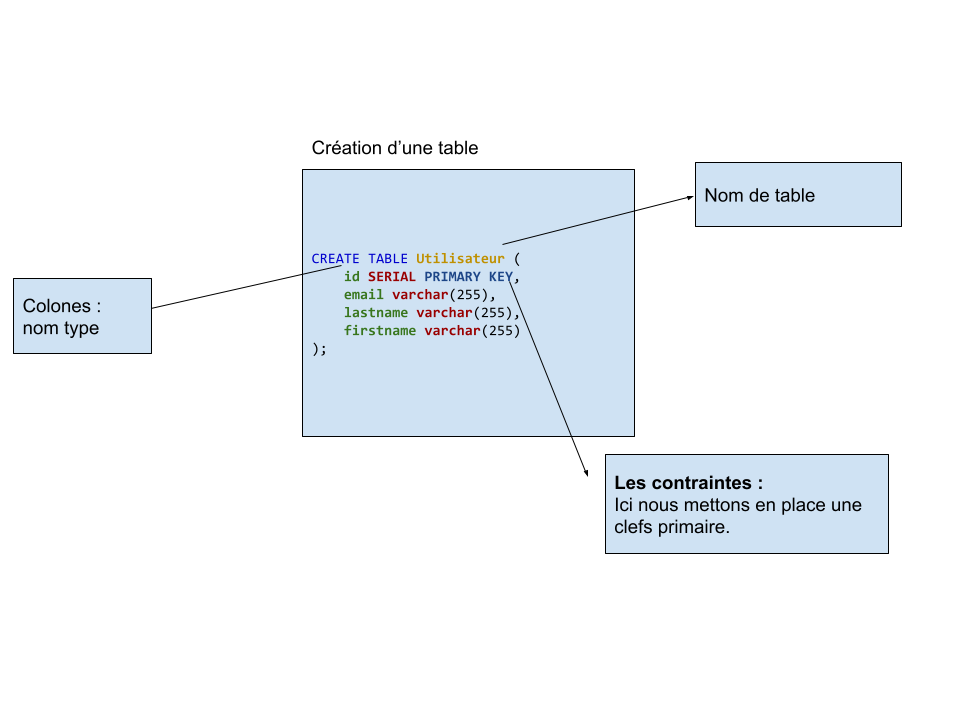
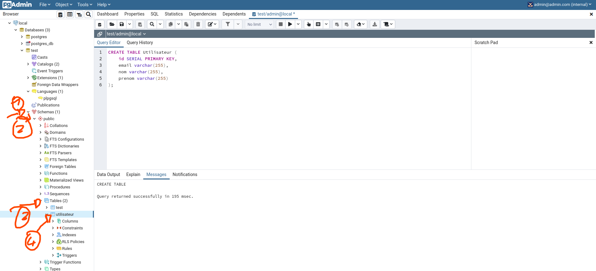

# Le SQL

Le SQL est un langage semantic permettant d'interargir avec une base de données.

Chaque instructions est ce qu'on appel une requête.

## Création de table

Il est possible d'utiliser le langage SQL afin de créer des tables :



Exemple :



[Documentation de `CREATE TABLE`](https://www.tutorialspoint.com/postgresql/postgresql_create_table.htm)

## Insérer des lignes dans une table

Pour insérer de nouvelles lignes dans une table il faut utiliser l'instruction : [`INSERT INTO`](https://www.tutorialspoint.com/postgresql/postgresql_insert_query.htm)
:

```sql
INSERT INTO Utilisateur (email, nom, prenom)
VALUES ('john@mail.com', 'doe', 'john');
```

Cette commande permet d'ajouter une nouvelle ligne dans la table Utilisateur.

> On spécifie jamais la clefs primaire dans un insert into. C'est la base de données qui s'occupe de générer une clefs primaire.

## Récupérer des lignes d'une table

Pour récupérer des lignes d'une base de données, il faut utiliser l'instruction [`SELECT`](https://www.tutorialspoint.com/postgresql/postgresql_select_query.htm)

Exemples :

```sql
SELECT id, email FROM Utilisateur;
```

> Pour séléctionner des résultats on spécifie d'abord les colones que l'on veut séléctionner et ensuite la table

On peut aussi séléctionner toutes les colones

```sql
SELECT * FROM Utilisateur;
```

## Modifier une ligne d'une table

Pour modifier une ligne d'une table en utilisant SQL, il faut utiliser l'instruction : [`UPDATE`](https://www.tutorialspoint.com/postgresql/postgresql_update_query.htm)

Cette intruction est un peu particulière car elle peut modifier 1 ou plusieurs lignes de notre base de données en une fois !

Ce update utilise des conditions. Pour faire une condition en SQL il faut utiliser l'instuction : [`WHERE`](https://www.tutorialspoint.com/postgresql/postgresql_where_clause.htm)

Exemple :

```sql
UPDATE Utilisateur
SET nom = 'Dupont', prenom = 'Jean'
WHERE id = 1;
```

## Supprimer des lignes de la base de données

Pour supprimer des lignes d'une table de notre base de données il faut utiliser l'instruction : [`DELETE`](https://www.tutorialspoint.com/postgresql/postgresql_delete_query.htm)

Cette instruction fonctionne de la même manière que le `UPDATE` :

```sql
DELETE FROM Utilisateur
WHERE id = 1;
```

> **Entrainez-vous** : SQL n'est pas un langage compliqué, il faut absolument maîtriser les bases car il devient très très vite complexe !
